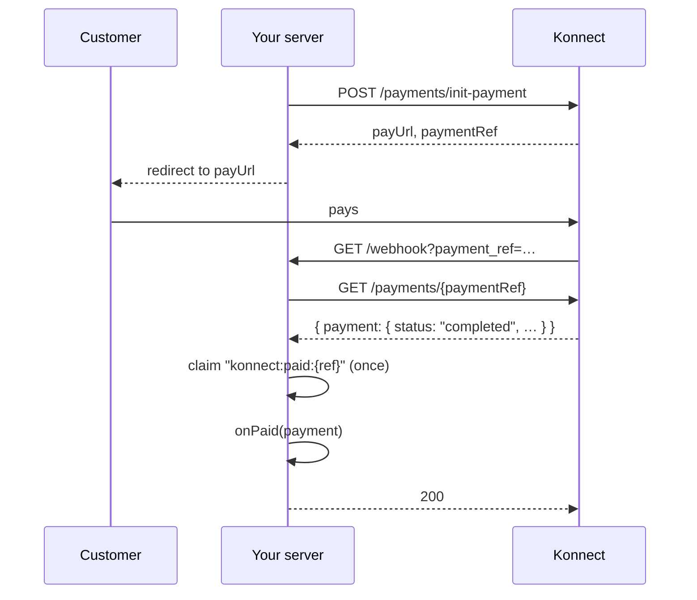

# How Konnect webhooks really work

What the docs say, what that means for your code, and what `@tnpay/konnect` does about it.

## The mechanism

When a payment's status changes, Konnect sends:

```
GET https://your-server/your-path?payment_ref=<reference>
```

That is the whole message. No body, no signature header, no secret, no timestamp. The only fact in it is the reference.

The docs do not say what response Konnect expects, whether it retries, or how long it waits. Assume at-least-once delivery, assume duplicates, and assume nothing about order.

## What that means

1. **Anyone can call your webhook.** The URL is in your HTML or guessable. A request saying `payment_ref=abc` does not mean `abc` was paid, or that `abc` exists.
2. **The same delivery can arrive twice.** Marking an order paid twice is harmless; sending two confirmation emails or decrementing stock twice is not.
3. **You will get a webhook for pending payments too**, for example when the customer opens the page.

So a handler must do one thing before anything else: ask Konnect.

## The sequence



## What the handler does, in order

| Step                                   | Outcome                                                                                       |
| -------------------------------------- | --------------------------------------------------------------------------------------------- |
| No `payment_ref` in the query          | `400 { error: "missing_payment_ref" }`                                                        |
| Konnect answers 404 for it             | `404 { error: "unknown_payment" }`                                                            |
| Konnect unreachable, times out, or 5xx | `502 { error: "NetworkError" \| "TimeoutError" \| "ApiError" }`, so a retry can succeed later |
| Status `paid`, first time              | `onPaid(payment)`, then `200 { ok: true, status: "paid" }`                                    |
| Status `paid`, already applied         | `200 { ok: true, status: "paid", duplicate: true }`; `onPaid` not called                      |
| `onPaid` throws                        | claim released, `500 { error: "handler_failed" }`; the next delivery calls `onPaid` again     |
| Status `pending`                       | `onPending` if given, `200`                                                                   |
| Status `failed` or `expired`           | `onFailed` if given, `200`                                                                    |

## Status mapping

Konnect's payment has `status: "completed" | "pending"` and a `transactions` array of attempts.

| Konnect                                                                     | tnpay     |
| --------------------------------------------------------------------------- | --------- |
| `completed`                                                                 | `paid`    |
| `pending`, `expirationDate` in the past                                     | `expired` |
| `pending`, last transaction status is `failed`/`failure`/`declined`/`error` | `failed`  |
| `pending` otherwise                                                         | `pending` |

The failure names are matched case-insensitively. Konnect's object is always on `payment.raw` if you need more.

## Testing it

`@tnpay/konnect/fake` delivers webhooks exactly this way, including twice and with references Konnect has never seen. The package's own tests cover every row of the table above, plus a property test that delivers random sequences and checks `onPaid` runs at most once.
